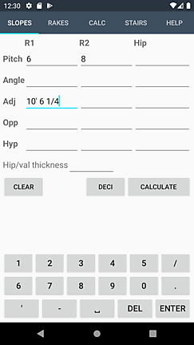
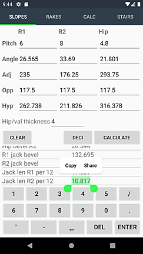
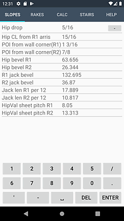
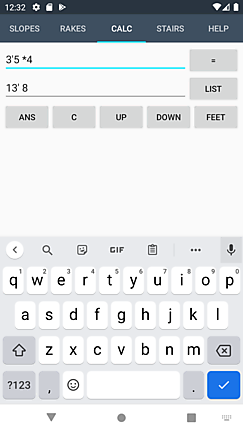
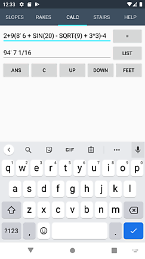
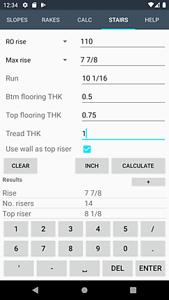
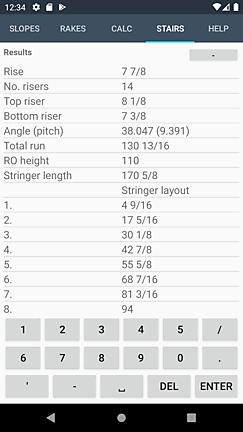

# What is FramingCalc?

FramingCalc provides an efficient way to calculate rafters, rake walls, and stair stringers. For support contact me at framingcalc@gmail.com.

  * [Input](#input)
  * [Slopes](#slopes)
  * [Rakes](#rakes)
  * [Calculator](#calculator)
  * [Stairs](#stairs)

## Input
Values can be input as decimal or fractional format. An apostrophe suffix added to a whole or decimal number denotes feet x' = x(*12).
Examples
* 1.25
* 1 1/4 = 1.25
* 1' 1 1/4 = 13.25
* 5' 6 = 66
* .5' = 6

All tabs can convert calculated values between decimal(to 3 decimal points), fractional, and feet and fractional formats which makes working with imperial measurements a breeze.

## Slopes
Calculates the sides and angles of right-angled triangles. For a roof adj = run, opp = rise, and hyp = rafter length. If enough information is provided to calculate R1 and R2 then a Hip rafter will also be calculated. Or just enter an adjacent or opposite to find the diagonal of a square corner etc. 

As seen in the screenshots, extra info is provided for hips and valleys included sheeting angles, hip drop, hip bevels and more.

## Rakes
Calculates the right angled triangle using given spacings and pitch (change in opp/(12 adj)). Adds opp to initial opp (Opp0). Can be used to generate a list of rake wall stud lengths and markings on top plate or a list of jack rafters.

## Calculator
A simple calculator. Supported operators: */+-^,sin,cos,tan,asin,acos,atan,sqrt. Trig functions use degree inputs. Results are displayed to 3 decimal points. List button starts a list of results. Up/Down cycles through the memory.

## Stairs
Calculates the information needed to cut stair stringers. Results are either calculated using a rough opening height and maximum riser or from a given riser and a number of treads. Provides a list of measurements corresponding to the stair tread points, this can be used to eliminate cumulative error when laying out the stringer.

Includes option of using wall as top riser. Can be used to calculate correct rise for straight flights, winders, stairs with landings.
